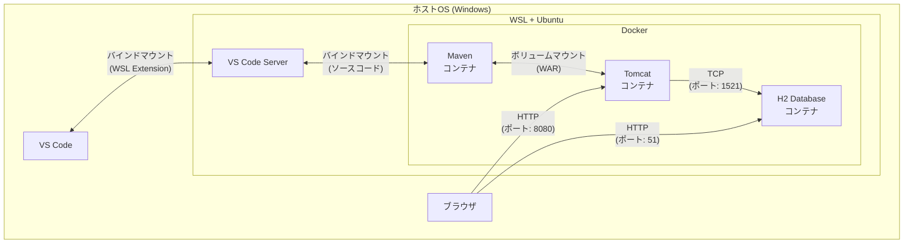
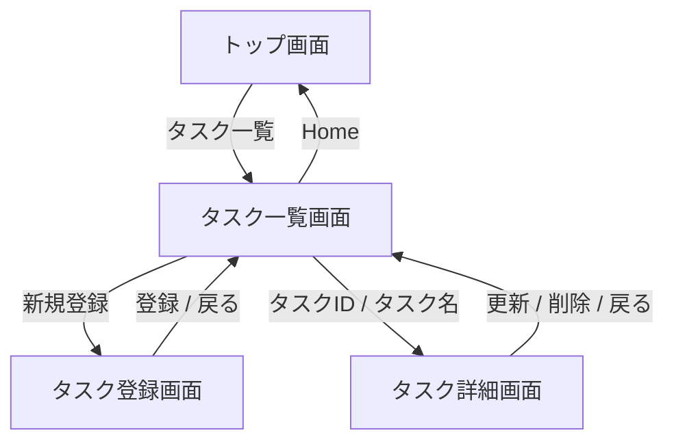

# todo-webapp-docker

## 概要
- 社内勉強会用に作成したWebアプリです。
- VSCode + Java + Tomcatの環境構築手順が煩雑であることからDocker版を作成しました。

## 目次
- [動作確認環境](#動作確認環境)
- [使用技術一覧](#使用技術一覧)
- [環境構築手順](#環境構築手順)
  - [1. WSL2 + Linuxディストリビューションのインストール](#1-wsl2--linuxディストリビューションのインストール)
  - [2. Docker + Docker Composeのインストール](#2-docker--docker-composeのインストール)
  - [3. VSCodeからDockerを操作できるようにする](#3-vscodeからdockerを操作できるようにする)
  - ※ Proxy環境下での手順資料は別途用意します。
- [ビルド・デプロイ手順](#ビルドデプロイ手順)
  - ※ Proxy環境下での手順資料は別途用意します。
- [その他のコマンド](#その他のコマンド)
- [設計情報](#設計情報)
  - [画面遷移図](#画面遷移図)
  - [クラス図](#クラス図)

## 動作確認環境
|                             |                         |
| --------------------------- | ----------------------- |
| ホストOS                    | Windows 10.0.26100.4652 |
| WSL2                        | 2.5.9.0                 |
| Linuxディストリビューション   | Ubuntu 24.04.1 LTS      |
| Docker Engine               | 28.3.3                  |
| VSCode                      | 1.102.3                 |
| VSCode WSL Extension        | 0.99.0                  |
| Google Chrome               | 138.0.7204.184  |

## 使用技術一覧
| 技術名      | バージョン | 説明                       | 選定理由                                                                                       |
| ----------- | ---------- | -------------------------- | ---------------------------------------------------------------------------------------------- |
| OpenJDK     | 17         | 開発言語                   | 勉強会の要件のため。                                                                           |
| Maven       | 3.9        | ビルドツール               | 依存関係の解決が容易になるため。加えて、ビルドコマンドがシンプルなため。                       |
| Tomcat      | 10         | Webサーバ                  | Javaのデファクトスタンダードであるため。                                                       |
| H2 database | 2.2.224    | データベース               | PostgreSQLと比較して軽量なため。加えて、Javaとの親和性が高く、インメモリでの動作も可能なため。 |
| Bootstrap   | 5.3.0      | スタイリング用のライブラリ | 勉強会の趣旨はバックエンドであり、フロントエンド側は極力簡実装の手間を省くため。               |

## 環境構築手順

### 1. WSL2 + Linuxディストリビューションのインストール
1-1. WSL2をインストールする。
  - `wsl --install`

1-2. PCを再起動する。

1-3. WSL2がインストールできたか確認する。
  - `wsl --version`

1-3. Linuxディストリビューションをインストールする。
  - `wsl --install Ubuntu`
    - パスワードを聞かれたら設定しておく。

1-4. Linuxディストリビューションがインストールできたか確認する。
  - `wsl --list`

### 2. Docker + Docker Composeのインストール
2-1. Ubuntuにログインする。
  - `wsl -d ubuntu`

2-2. Ubuntu内にDockerをインストールする。
  - `sudo apt update`
  - `curl https://get.docker.com | sh`

2-3. docker-composeをインストールする。
  - `sudo curl -L "https://github.com/docker/compose/releases/download/v2.39.1/docker-compose-$(uname -s)-$(uname -m)" -o /usr/local/bin/docker-compose`
  - `sudo chmod +x /usr/local/bin/docker-compose`
  - `sudo apt install -y docker-compose`

2-4. Dockerの動作確認を行う。
  - `sudo docker run --rm hello-world`
    - Hello from Docker!と表示されればOK

2-5. sudoなしでdockerコマンドを使用可能にする。
  - ※VSCodeの拡張機能から実行できるようにするために必要な設定
  - `sudo group add docker`
    - already existsと言われたらスキップ
  - `sudo usermod -aG docker $USER`
  - `exit`
  - コンソールに入りなおすとsudoが不要になっているはず

### 3. VSCodeからDockerを操作できるようにする
3-1. VSCodeにWSL Extensionをインストールする。

3-2. VSCodeにDocker Extensionをインストールする。

3-3. VSCodeからWSL(Ubuntu)に接続する。
  - `Ctrl + Shift + P`
  - `WSL: Connect to WSL using Distro in New Window` -> Ubuntuを選択

3-4. 開発用のプロジェクトフォルダを作成する。
  - ※任意のパスでOK

## ビルド・デプロイ手順
- todoフォルダに移動する。
  - `cd {path_to_your_project}/todo`

- コンテナを起動する。(ビルド＋デプロイ)
  - `docker compose up -d --build`
  
- ブラウザから`http://localhost:8080/todo/top`にアクセスする。

## その他のコマンド
- コンテナを終了する。(アプリを終了する)
  - `docker compose down`

- 再ビルド(ソースコードを変更したら実施)
  - `docker compose up -d --build maven`
  - ※ Tomcatのホットデプロイまで少し時間かかるのて注意

- コンテナのログを見る(デバッグ用)
  - `docker logs {コンテナ名}`

- コンテナの中に入る
  - `docker exec -it {コンテナ名} sh`

- 停止中・停止予定のコンテナを削除する
  - `docker container prune`

- 起動中のコンテナを確認する
  - `docker-compose ls -a`

- イメージの一覧を表示する
  - `docker images -a`

- すべてのイメージを一括削除する
  - `docker rmi $(docker images -q)`

## 設計情報

### 画面遷移図

### クラス図

