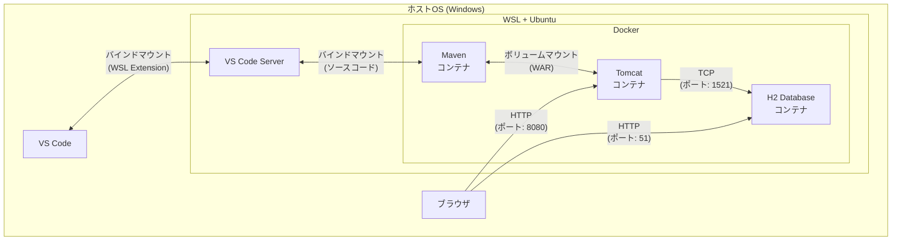
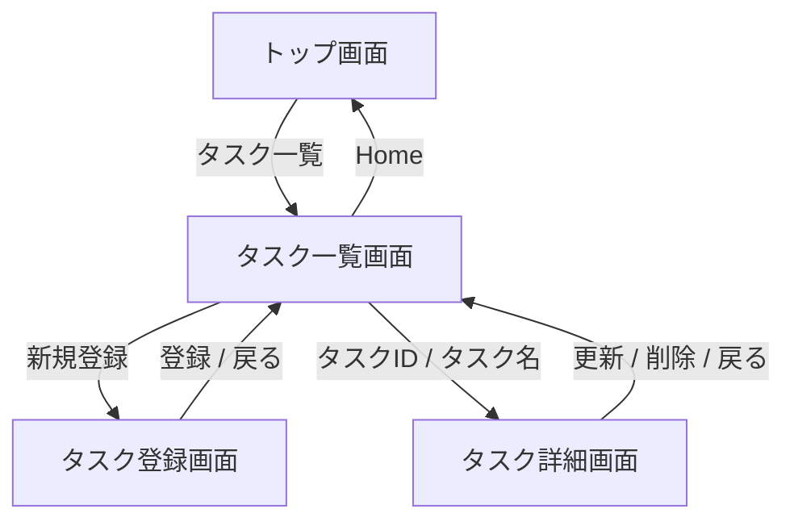
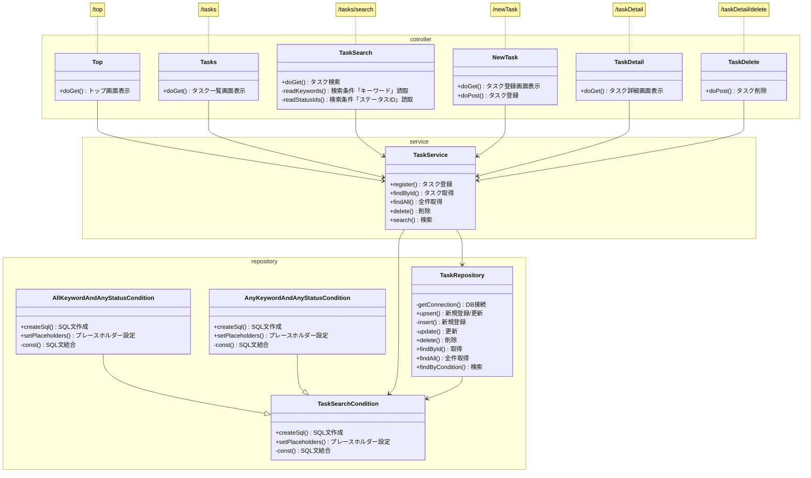

# todo-webapp-docker

## 概要

- 社内勉強会用に作成したWebアプリです。
- VSCode + Java + Tomcatの環境構築手順が煩雑であることからDocker版を作成しました。

## 目次

- [todo-webapp-docker](#todo-webapp-docker)
  - [概要](#概要)
  - [目次](#目次)
  - [動作確認環境](#動作確認環境)
  - [使用技術一覧](#使用技術一覧)
  - [環境構築手順](#環境構築手順)
  - [ビルド・デプロイ手順](#ビルドデプロイ手順)
  - [Dockerコマンドチートシート](#dockerコマンドチートシート)
  - [設計情報](#設計情報)
    - [画面遷移図](#画面遷移図)
    - [クラス図](#クラス図)

## 動作確認環境

|                             |                         |
| --------------------------- | ----------------------- |
| ホストOS                    | Windows 10.0.26100.4652 |
| WSL2                        | 2.5.9.0                 |
| Linuxディストリビューション   | Ubuntu 24.04.1 LTS      |
| Docker Engine               | 28.3.3                  |
| VSCode                      | 1.102.3                 |
| VSCode WSL Extension        | 0.99.0                  |
| Google Chrome               | 138.0.7204.184  |

## 使用技術一覧

| 技術名      | バージョン | 説明                       | 選定理由                                                                                       |
| ----------- | ---------- | -------------------------- | ---------------------------------------------------------------------------------------------- |
| OpenJDK     | 17         | 開発言語                   | 勉強会の要件のため。                                                                           |
| Maven       | 3.9        | ビルドツール               | 依存関係の解決が容易になるため。加えて、ビルドコマンドがシンプルなため。                       |
| Tomcat      | 10         | Webサーバ                  | Javaのデファクトスタンダードであるため。                                                       |
| H2 database | 2.2.224    | データベース               | PostgreSQLと比較して軽量なため。加えて、Javaとの親和性が高く、インメモリでの動作も可能なため。 |
| Bootstrap   | 5.3.0      | スタイリング用のライブラリ | 勉強会の趣旨はバックエンドであり、フロントエンド側は極力簡実装の手間を省くため。               |

## 環境構築手順



- WSL2のインストール

``` bash
wsl --install
wsl --version # インストール成否の確認
```

- Ubuntuのインストール

``` bash
wsl --install Ubuntu  # 途中でパスワードを聞かれるので設定する
wsl --list            # インストール成否の確認
```

- Ubuntuにログイン

``` bash
wsl -d Ubuntu
```

- apt用プロキシ設定
`/etc/apt/apt.conf.d/95proxies`に以下を追記する。

``` conf
Acquire::http::Proxy "http://proxy.example.com:8080";
Acquire::https::Proxy "http://proxy.example.com:8080";
```

- curl用プロキシ設定
  `~/.bashrc`に以下を追記する。

``` conf
export http_proxy="http://proxy.example.com:8080"
export https_proxy="http://proxy.example.com:8080"
```

- Dockerのインストール

``` bash
sudo apt update
curl https://get.docker.com | sh
sudo docker run --rm hello-world # 動作確認 Hello form Docker!と表示されればOK
```

- sudoなしでdockerコマンドをを使用可能にする

``` bash
sudo group add docker         # already existsと言われたらスキップ
sudo usermod -aG docker $USER
exit                          # 再度Ubuntuにログインするとsudoが不要になっているはず
```

- Docker用プロキシ設定
  - 設定ファイルを作成する。

  ``` bash
  sudo mkdir -p /etc/systemd/system/docker.service.d
  sudo vim /etc/systemd/system/docker.service.d/http-proxy.conf
  ```

  - 設定ファイルにプロキシの設定を記述する。

  ``` bash
  [Service]
  Environment="HTTP_PROXY=http://proxy.example.com:8080"
  Environment="HTTPS_PROXY=http://proxy.example.com:8080"
  ```

  - dockerを再起動する。

  ``` bash
  sudo systemctl daemon-reexec
  sudo systemctl daemon-reload
  sudo systemctl restart docker
  ```

- VSCodeに拡張機能をインストール
  - WSL
  - Docker

## ビルド・デプロイ手順

- ソースコードをダウンロード
  - [リポジトリ](https://github.com/Shun100/todo-webapp-docker)
<br>
- VSCodeからWSL(Ubuntu)に接続
  - `Ctrl + Shift + P`
  - `WSL: Connect to WSL using Distro in New Window` -> Ubuntuを選択
<br>
- ソースコードのディレクトリに移動
  WindowsのCドライブとUbuntuの`/mnt/c`が自動的にマウントされているので以下のディレクトリに移動する。

``` bash
cd /mnt/c/your-project/todo
```

- Mavenのプロキシ設定
  `todo/settings.xml`

``` xml
<host>your.proxy.co.jp</host>
```

- ビルド + デプロイ

``` bash
docker compose up -d --build
```

- 動作確認
  - ブラウザから`http://localhost:8080/todo/top`にアクセス

## Dockerコマンドチートシート

``` bash
# コンテナの終了
docker compose down

# 再ビルド（ソースコードを変更した実施）
docker compose up -d --build maven

# コンテナのログを表示
docker logs コンテナ名

# コンテナの中に入る
docker exec -it コンテナ名 sh

# 停止中・停止予定中のコンテナを削除
docker container prune

# 起動中のコンテナを確認
docker compose ls -a

# イメージの一覧を表示
docker image -a

# すべてのイメージを一括削除
docker rmi $(docker images -q)
```

## 設計情報

### 画面遷移図



### クラス図

